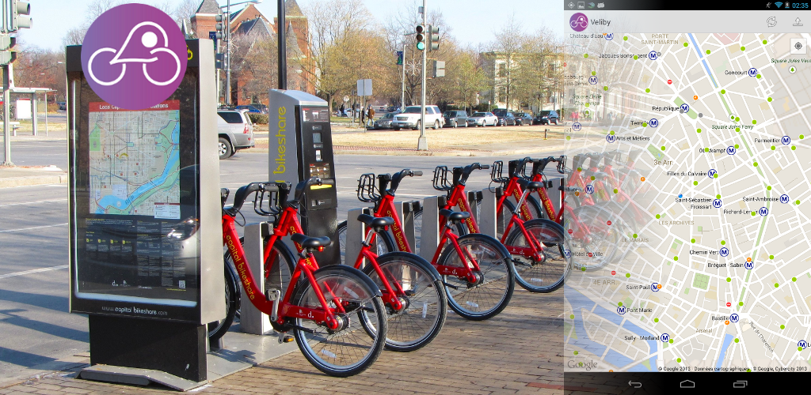

Veliby
======

Veliby is a fully fledged bike share station finder working all around the world. Started in Paris, hence the name Velib'y.

At its height, it had 200+ MAUs with 1000+ downloads on the Google Play Store.

The principle was dead simple:
* You should see at a glance what stations around you have a bike or a free bike spot.
* Green for many, orange for a few, red for none.
* Do it fast, unlike official apps - the server would cache the info for you, parse, filter, and compress for blazing fast updates once the stations in a city are downloaded.

At the time, Android supported widgets on the lock screen, and so did Veliby!

